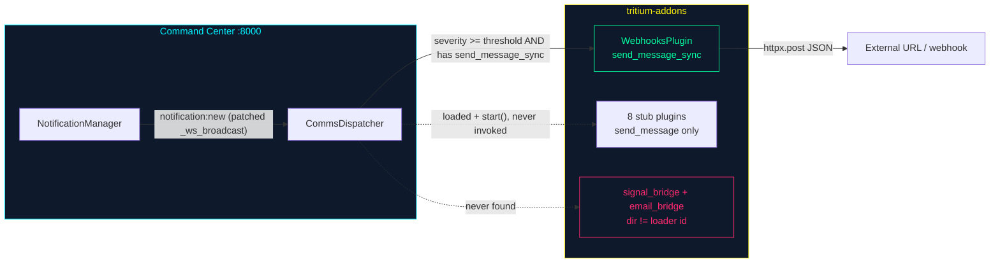

# Comms-Bridge Addons — the second addon archetype

Most addons in this repo bring the world **in**: a sensor detects something and
publishes a target (hackrf, meshtastic — see [DEVELOPER-GUIDE.md](DEVELOPER-GUIDE.md)).
The ten `communications` addons run the other direction: they relay Tritium's own
**notifications out** to a chat or messaging channel — Discord, Slack, Signal,
email, SMS, satellite, a generic webhook. That opposite data flow needs a
different shape, so these addons do **not** subclass `SensorAddon`/`AddonBase`.
They are a distinct, lighter archetype the developer guide doesn't cover. This
document is that coverage — grounded in the code as it is today.

> **Status honesty up front:** of the ten, **one has a real send path**
> (`webhooks`, via `httpx`), **nine are pure stubs** (they log "Would send" and
> return `True`), and — because of a loader ID/dir-name mismatch — **only eight
> of the ten are even loaded** at runtime. The manifest's flat "10 stubs" label
> is wrong in three different ways. Details in [Reality check](#reality-check).

## The two archetypes, side by side

| | Sensor / connector addon | Comms-bridge addon |
|---|---|---|
| Example | `hackrf`, `meshtastic`, `isaac_sim` | `webhooks`, `discord`, `slack`, … |
| Direction | world → Tritium (targets in) | Tritium → world (notifications out) |
| Base class | subclasses `SensorAddon`/`AddonBase` (`tritium_lib.sdk`) | **bare class**, duck-typed — no base |
| Discovered by | `AddonLoader` (`engine/addons/loader.py`) | `CommsDispatcher` (`app/comms_dispatcher.py`) |
| Entry file | `<addon>/<addon>_addon/__init__.py` | `<addon>/plugin.py` |
| Lifecycle | `register()` / `unregister()` (async) | `configure()` / `start()` / `stop()` |
| Wired to | tactical map, panels, MQTT, `/api/addons/*` | the notification bus (see below) |

## The plugin contract (duck-typed)

A comms-bridge entry point is a plain class named `<Name>Plugin` in
`plugin.py`. It subclasses nothing; the dispatcher relies on these
attributes/methods existing:

| Member | Kind | Purpose |
|---|---|---|
| `plugin_id` | property | `tritium.comms.<id>` |
| `name`, `version` | property | display metadata |
| `capabilities` | property → `set` | e.g. `{"chat_bridge", "alert_relay"}` |
| `healthy` | property → `bool` | usually `running AND enabled AND configured` |
| `configure(ctx, **overrides)` | method | inject logger/event_bus + config |
| `start()` / `stop()` | method | lifecycle; real I/O gated on `enabled` |
| `async send_message(text, **kw)` | method | the async send — **all ten** define this |
| `async relay_alert(alert)` | method | format an alert dict → `send_message` |
| `send_message_sync(text, payload)` | method | **only `webhooks` defines this** — see the gotcha below |

The stub body is uniform across the nine (`discord/plugin.py:64-69` is the
canonical copy):

```python
async def send_message(self, text: str, **kwargs) -> bool:
    if not self.healthy:
        return False
    log.info(f"[Discord] Would send: {text[:80]}")
    return True  # Stub — always succeeds
```

`webhooks` is the exception — `webhooks/plugin.py:95-132` (`send_message_sync`)
does a real `httpx.post(url, json=body)` and returns `True` only on a 2xx, gated
on `healthy` (which needs `enabled` **and** a `webhook_url`, set via
`WEBHOOKS_URL` / `WEBHOOKS_ENABLED`).

## How they get wired — the CommsDispatcher

There is a real dispatcher, attached at boot; it deliberately **bypasses** the
`AddonLoader` (which only mounts `AddonBase` subclasses) and hand-loads each
`plugin.py`.



Mechanics (all in `tritium-sc/src/app/comms_dispatcher.py`, wired in
`tritium-sc/src/app/main.py:2036-2054`):

1. `attach_comms_dispatcher(notification_manager, <repo>/tritium-addons)` runs at
   startup.
2. `_load_comms_plugins` (`:43-70`) walks a **hardcoded** id set
   (`_STUB_ADDON_IDS`, `:31-34`, plus `"webhooks"`), imports
   `<addons_root>/<id>/plugin.py` via `importlib`, grabs the first `*Plugin`
   class, then calls `configure()` and `start()`.
3. It **monkey-patches** `NotificationManager._ws_broadcast` so every
   `notification:new` event is also handed to `CommsDispatcher.handle_notification`.
4. `handle_notification` (`:116-133`) drops notifications below a severity
   threshold (default `warning`), then, for each loaded plugin, calls it **only
   if** `hasattr(plugin, "send_message_sync")`.

Diagnostics: `GET /api/notifications/dispatcher/stats` reports what loaded; a
synthetic-notification endpoint (`notifications.py:225`) exercises the webhooks
path when `WEBHOOKS_URL` is set.

## Reality check

The verified truth, addon by addon (send-path bodies read directly, not grepped):

| Addon | Loaded? | On dispatch path? | Real send? | Notes |
|---|---|---|---|---|
| **webhooks** | yes | **yes** | **yes** — `httpx.post` (`plugin.py:115`) | inert until `WEBHOOKS_URL`+`WEBHOOKS_ENABLED` |
| discord | yes | no | no — stub | `send_message` returns `True`, no I/O |
| telegram | yes | no | no — stub | |
| irc | yes | no | no — stub | |
| matrix | yes | no | no — stub | |
| slack | yes | no | no — stub | |
| sms_gateway | yes | no | no — stub | loader id `sms_gateway` matches dir |
| satellite | yes | no | no — stub | |
| **signal_bridge** | **no** | no | no — stub | orphaned — loader looks for dir `signal` |
| **email_bridge** | **no** | no | no — stub | orphaned — loader looks for dir `email` |

Three distinct drifts fall out of this, all **routed to the code owners** (this
is the docs lane — it records, it does not patch tritium-sc):

- **D1 — `signal_bridge` / `email_bridge` never load.** `_STUB_ADDON_IDS`
  (`comms_dispatcher.py:33`) lists `"signal"` and `"email"`, but the directories
  were renamed to `signal_bridge` / `email_bridge` (the old names shadowed the
  Python stdlib `signal` module and `email` package). The dispatcher builds
  `addons_root/signal/plugin.py`, finds nothing, and silently skips both. Fix
  belongs in the SC dispatcher (map id → dir), not here.
- **D2 — all ten `routes.py` routers are dead code.** Each defines a real
  `create_router(plugin)` (`GET/PUT /config`, `GET /status`, `POST /test`,
  `POST /send`, prefix `/api/comms/<id>`), but nothing imports them — the
  dispatcher never mounts routers, and the `AddonLoader` skips these non-`AddonBase`
  classes. **`/api/comms/*` is not served by the running app.**
- **D3 — the stubs are only reachable via `send_message_sync`.** The dispatcher's
  fan-out (`:129`) requires that method; only `webhooks` has it. So the eight
  loaded stubs are `start()`ed but their `send_message` is never called from a
  notification — even their "Would send" logs stay silent.

There is also **manifest self-drift inside `webhooks`**: `tritium_addon.toml`
says `version = "0.1.0"` and `capabilities = chat_bridge, alert_relay`, but the
code returns `version = "0.2.0"` and `capabilities = {"alert_relay",
"event_bridge"}` (`plugin.py:53,57`). And `addon-index.json` still files webhooks
under `status: "stub"`.

> **A note on `addon-index.json`:** that catalog's self-description ("the Command
> Center reads this … grays out addons whose repo isn't installed") is
> aspirational — **no code reads the file**. The live Addon Manager panel
> (`addons-manager.js`) discovers *installed* addons from `/api/addons/` and
> `/api/addons/manifests` (filesystem discovery via `AddonLoader`), not from this
> JSON. The catalog is a cross-repo spec; wiring it into the UI is future work.

## Making a stub real

Use `webhooks` as the worked example — it is the template for turning any of the
nine into a live bridge:

1. Add a real client to `send_message` (open the socket / call the SDK / POST).
   Follow the `webhooks` gate: no network at import or `start()`; only send when
   `healthy` (config present **and** `enabled`).
2. **Add a synchronous `send_message_sync(text, payload)`** — without it the
   dispatcher will load and `start()` your plugin but never call it. `webhooks`
   implements the async `send_message` as a thread-executor wrapper over
   `send_message_sync` (`plugin.py:134-142`); mirror that.
3. Keep the manifest honest — `version`, `capabilities`, and the index
   `status` must match what the code actually does (webhooks' own metadata
   currently doesn't — don't copy that mistake).
4. If the addon should also expose HTTP config/test endpoints, the dispatcher
   won't mount `routes.py` today (D2). Until that's wired, drive it purely from
   the notification fan-out (like webhooks) or add the addon through the
   `AddonBase` path instead.
5. Add tests — the nine stubs have none; a real bridge must.

## Related

- [DEVELOPER-GUIDE.md](DEVELOPER-GUIDE.md) — the sensor/connector archetype (`AddonBase`)
- [README.md](README.md) — addon status table + catalog
- Per-addon detail: each comms addon's own `README.md`
- Dispatcher source: `tritium-sc/src/app/comms_dispatcher.py`

---

AGPL-3.0 | Copyright 2026 Valpatel Software LLC
