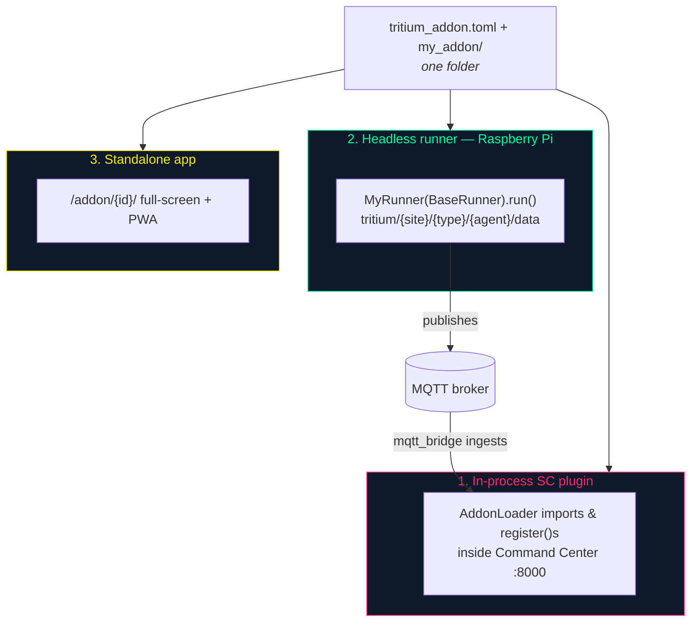
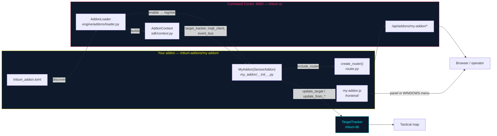

# Addon Developer Guide

**Where you are:** `tritium-addons/DEVELOPER-GUIDE.md` — the canonical,
follow-it-front-to-back guide for writing a Tritium addon. Start here if
you want to add a sensor, a data feed, a comms channel, or a map layer
to the Command Center.

**Parent:** [`README.md`](README.md) (addon catalog & status) ·
[`CLAUDE.md`](CLAUDE.md) (repo conventions) ·
SDK reference: [`tritium-lib/src/tritium_lib/sdk/README.md`](https://github.com/Valpatel/tritium-lib/blob/main/src/tritium_lib/sdk/README.md)

Every claim below is grounded in code you can open. Citations are
`repo-relative-path:line` and name the submodule. Verified against
`dev` on 2026-07-11.

---

## 1. What an addon is (and is not)

An **addon** is a self-contained folder that the Command Center
discovers, loads, and wires into the running system without any change
to core code. It brings one or more of: a hardware/API **sensor**, a
**FastAPI router** (`/api/addons/{id}/…`), **UI panels** and **map
layers**, and an optional **headless runner** that streams data over
MQTT from a remote box.

The SDK it programs against — `tritium_lib.sdk` — is **Apache-2.0
licensed** (not the repo-wide AGPL-3.0), on purpose: proprietary /
closed-source addons may import it freely. See the license banner in
[`tritium-lib/src/tritium_lib/sdk/__init__.py:5-7`](https://github.com/Valpatel/tritium-lib).

**An addon is not a connector.** An addon *imports the SDK* and runs
either inside the Command Center or as an SDK-based runner. A pure
external system that must never import Tritium at all (e.g. a physics
sim or a third-party stack talking a wire protocol) is a *connector* —
it speaks MQTT / CoT / an HTTP seam and appears as a device, not as a
loaded addon. If you are writing something that never `import`s
`tritium_lib`, you want the MQTT device path
([`tritium-sc/docs/EMBODIMENTS.md`](https://github.com/Valpatel/tritium-sc/blob/main/docs/EMBODIMENTS.md)),
not this guide.

Two addons in this repo are fully functional and are the worked
examples used throughout: **`hackrf/`** (SDR) and **`meshtastic/`**
(LoRa mesh). The other ten dirs are comms stubs.

---

## 2. The three modes one addon can run in

The same addon folder serves up to three deployment shapes. You do not
have to implement all three; a sensor-only addon is common.



1. **In-process SC plugin** — the loader imports your module and calls
   `register()` inside the Command Center process. Routes, panels, and
   map layers appear. This is the default and the one this guide walks.
2. **Headless runner** — a `BaseRunner` subclass runs on a separate box
   (e.g. a Pi next to the radio) and publishes to MQTT; the in-process
   plugin's `mqtt_bridge` ingests those remote detections. See §9.
3. **Standalone app** — the Command Center serves your panel full-screen
   at `/addon/{id}/` with a generated PWA manifest, for tablets/kiosks.
   Served by [`tritium-sc/src/app/main.py:2871`](https://github.com/Valpatel/tritium-sc)
   (`addon-standalone.html` with `__ADDON_ID__` substituted) and the PWA
   manifest at `main.py:2893`.

---

## 3. Anatomy of an addon

The layout the loader expects (mirrors `hackrf/` and `meshtastic/`):

```
my-addon/
├── tritium_addon.toml          # Manifest — metadata, routes, panels, perms
├── my_addon/                    # Python backend package (module name = id + "_addon")
│   ├── __init__.py             # class MyAddon(SensorAddon) — the entry point
│   ├── router.py               # FastAPI routes → /api/addons/my-addon/*
│   ├── runner.py               # class MyRunner(BaseRunner) — headless mode (optional)
│   ├── mqtt_bridge.py          # ingest remote runners' MQTT data (optional)
│   └── data_store.py           # AsyncBaseStore subclass for persistence (optional)
├── frontend/
│   └── my-addon.js             # Vanilla-JS panel (no frameworks)
└── tests/
    └── test_my_addon.py
```

Two hard conventions the loader relies on
([`tritium-sc/src/engine/addons/loader.py:168-191`](https://github.com/Valpatel/tritium-sc)):

- **Module name** defaults to `{id.replace('-', '_')}_addon` — so
  addon id `hackrf` → package `hackrf_addon/`, id `my-addon` →
  `my_addon/`. Override with `[backend] module = "…"` in the manifest.
- **Entry-point class** — the loader imports the module and picks the
  **first** `AddonBase` subclass it finds at top level (that is not
  `AddonBase` itself and does not start with `_`). Export exactly one
  from your package `__init__.py`.

---

## 4. The manifest — `tritium_addon.toml`

Parsed and validated by
[`tritium-lib/src/tritium_lib/sdk/manifest.py`](https://github.com/Valpatel/tritium-lib)
(`load_manifest` :94, `validate_manifest` :177). A minimal valid
manifest needs only `[addon] id / name / version`; everything else has a
default. Here is the full surface, annotated:

```toml
[addon]
id = "my-addon"              # REQUIRED. lowercase, digits, hyphens only (validated :196)
name = "My Custom Addon"     # REQUIRED. Display name.
version = "1.0.0"            # REQUIRED.
description = "What it does"
author = "Your Name"
license = "AGPL-3.0"         # AGPL-3.0 (public) or your own (private addon)
addon_api = ">=1.0, <2.0"    # SDK compat range; SDK_VERSION is 1.0.0

[addon.category]             # Which consolidated window the panel joins
window = "sensors"           # e.g. radio, sensors, system, simulation
tab_order = 10
icon = "📡"

[dependencies]
requires = []                # ids of other addons that must be enabled first (:156)
optional = []
python_packages = ["meshtastic>=2.3"]   # pip deps — informational; you still install them

[hardware]
devices = ["my-device"]
serial_vid_pid = ["303a:1001"]   # for USB auto-detect
auto_detect = true

[permissions]                # Declared intent (surfaced to the operator)
serial = true
network = true
mqtt = true
storage = true

[backend]
module = "my_addon"                        # defaults to {id_with_underscores}_addon
router_prefix = "/api/addons/my-addon"     # defaults to /api/addons/{id}
mqtt_topics = ["tritium/{site}/my-addon/+/data"]   # topics the plugin subscribes to

[frontend]
panels = [
    { id = "my-addon", title = "MY ADDON", file = "my-addon.js", tab_order = 1 },
]
layers = [
    { id = "myLayer", label = "My Layer", category = "SENSORS", color = "#00d4aa" },
]
context_menu = [
    { label = "Ping node", action = "my-addon:ping", when = "target.source == 'mine'" },
]
shortcuts = [
    { key = "Shift+M", action = "my-addon:toggle", description = "Toggle my layer" },
]

[config]                     # Optional runtime config schema (see §8)
poll_interval = { default = 30, type = "int", label = "Poll seconds" }
```

`validate_manifest` rejects a manifest that is missing `id`/`name`/
`version`, has an id with illegal characters, or has a panel/layer
missing `id`/`title`/`label`. Compare against the real ones:
[`hackrf/tritium_addon.toml`](hackrf/tritium_addon.toml) and
[`meshtastic/tritium_addon.toml`](meshtastic/tritium_addon.toml).

---

## 5. The entry point — subclass `AddonBase`

Pick the interface that matches what your addon *does*
([`tritium-lib/src/tritium_lib/sdk/interfaces.py`](https://github.com/Valpatel/tritium-lib)):

| Base class | Override | For |
|------------|----------|-----|
| `SensorAddon` | `gather()` | collects data → targets (BLE, camera, SDR, mesh) |
| `ProcessorAddon` | `process(target)` | enrich one target (classify, score) |
| `AggregatorAddon` | `aggregate(targets)` | fuse many (correlate, trilaterate) |
| `CommanderAddon` | `think(situation)`, `speak(msg)` | decide & dispatch (Amy is one) |
| `BridgeAddon` | `send(targets)`, `receive()` | external I/O (TAK, webhook, federation) |
| `DataSourceAddon` | `fetch()`, `process_data(data)` | poll an external API on `refresh_interval` |
| `PanelAddon` | `get_panels()` | UI-only, no backend logic |
| `ToolAddon` | `register()` | dev/ops tooling |

All eight subclass `AddonBase`
([`sdk/addon_base.py:38`](https://github.com/Valpatel/tritium-lib)),
whose two lifecycle methods are the contract:

```python
from tritium_lib.sdk import SensorAddon, AddonInfo

class MyAddon(SensorAddon):
    info = AddonInfo(id="my-addon", name="My Addon", version="1.0.0",
                     category="sensors", icon="📡")

    async def register(self, app=None, *, context=None):
        await super().register(app, context=context)   # wires the addon-event bus
        # start hardware, subscribe to events, include your router
        if context and context.router_handler:
            from .router import create_router
            context.router_handler.include_router(
                create_router(self), prefix="/api/addons/my-addon", tags=["my-addon"])

    async def unregister(self, app=None):
        # MUST be idempotent and finish within 10 s (addon_base.py:91-100)
        await super().unregister(app)   # cancels tracked tasks, unsubscribes
```

`AddonBase` also gives you, for free: `get_panels()`, `get_layers()`,
`get_geojson_layers()`, `get_context_menu_items()`, `get_shortcuts()`,
`health_check()`, and inter-addon `publish_addon_event()` /
`subscribe_addon_event()`. Override the ones you use; the base returns
sane empties. The real example
[`hackrf/hackrf_addon/__init__.py`](hackrf/hackrf_addon/__init__.py)
overrides `register`, `unregister`, `gather`, `get_panels`,
`get_layers`, `get_geojson_layers`, and `health_check`.

### How the loader turns your class into a running addon

[`tritium-sc/src/engine/addons/loader.py`](https://github.com/Valpatel/tritium-sc),
wired at startup in
[`tritium-sc/src/app/main.py:2419-2441`](https://github.com/Valpatel/tritium-sc):



1. **discover** (`loader.py:112`) — globs `*/tritium_addon.toml` across
   four dirs (`main.py:2420-2427`): local `addons/`, this submodule
   `../tritium-addons/`, private `../tritium-addon-priv/` (grays out if
   absent), and `~/.tritium/addons/`. Invalid manifests are skipped
   with a warning.
2. **enable** (`loader.py:137`) — checks `requires` deps, adds the addon
   dir to `sys.path`, imports the module, finds your `AddonBase`
   subclass, instantiates it, builds an `AddonContext`, and
   `await instance.register(app, context=context)`.
3. **control at runtime** — the operator API
   [`tritium-sc/src/app/routers/addons.py`](https://github.com/Valpatel/tritium-sc)
   exposes `GET /api/addons/` (list), `/manifests`, `/geojson-layers`,
   `/health`, and auth-gated `POST /{id}/enable`, `/{id}/disable`,
   `/{id}/reload`, `/rediscover`.

---

## 6. What you get injected — `AddonContext`

Instead of digging through `app.state`, `register()` receives a typed
`AddonContext`
([`tritium-lib/src/tritium_lib/sdk/context.py`](https://github.com/Valpatel/tritium-lib)):

| Field | Type (protocol) | Use |
|-------|-----------------|-----|
| `target_tracker` | `ITargetTracker` | put entities on the tactical map (§7) |
| `event_bus` | `IEventBus` | publish/subscribe system events |
| `mqtt_client` | `IMQTTClient` | publish/subscribe MQTT (may be None) |
| `router_handler` | `IRouterHandler` | `include_router(router, prefix, tags)` |
| `site_id` | `str` | the site namespace (default `"home"`) |
| `data_dir` | `str` | writable dir for your files/DB |
| `state` | `dict` | **survives hot-reload** — stash handles here |
| `addon_event_bus` | `AddonEventBus` | inter-addon pub/sub |
| `app` | `Any` | raw escape hatch — avoid |

Each field may be `None` (headless test, service not up) — always guard.
The protocols are structural, not concrete classes
([`sdk/protocols.py`](https://github.com/Valpatel/tritium-lib)), so you
program against `ITargetTracker.update_target(id, data)`, not a specific
implementation.

Use `context.set_state(k, v)` / `context.get_state(k)` for anything that
must outlive a `reload` — the loader preserves each addon's `state`
namespace across hot-reloads (`loader.py:200-214`).

---

## 7. Getting targets onto the map — the honest path

This is the part every previous doc glossed. `SensorAddon` declares
`gather() -> list[dict]`, and the docstring says "override gather() to
collect and emit targets" — **but nothing in the Command Center polls
`gather()`**. Verified 2026-07-11: the only callers of `.gather()` in
the entire tree are inside the SDK's own
`sdk/examples/weather_station/__init__.py` (which drives its *own* poll
loop). The SC runtime never calls it.

So to actually make entities appear on the tactical map, the functional
addons **push to the tracker themselves** from a background task or a
decoder callback, using the concrete tracker's typed update methods:

- HackRF ADS-B aircraft → `target_tracker.update_from_adsb(...)`
  ([`hackrf/hackrf_addon/decoders/adsb.py:828-833`](hackrf/hackrf_addon/decoders/adsb.py),
  with a `update_from_mesh` fallback). The decoder gets its
  `target_tracker` handle in `HackRFAddon.register()`
  (`__init__.py:106`).
- Meshtastic nodes → `target_tracker.update_from_mesh(t)`
  ([`meshtastic/meshtastic_addon/node_manager.py:79-83`](meshtastic/meshtastic_addon/node_manager.py))
  and messages → `target_tracker.update_target(target)`
  ([`message_bridge.py:319`](meshtastic/meshtastic_addon/message_bridge.py)).

The one method the `ITargetTracker` protocol *guarantees* is
`update_target(target_id, data)` (`sdk/protocols.py:19`); the
`update_from_adsb` / `update_from_mesh` helpers exist on the concrete SC
tracker and the addons reach them via `getattr` with a fallback. The
minimal, portable pattern for your addon:

```python
async def _poll_loop(self):
    while self._registered:
        for entity in await self._read_hardware():
            if self.target_tracker:           # from AddonContext, may be None
                self.target_tracker.update_target(entity["target_id"], entity)
        await asyncio.sleep(self._interval)
```

Start that task in `register()` and append it to `self._background_tasks`
so `AddonBase.unregister()` cancels it for you
(`addon_base.py:102-105`). A target dict should carry at least
`target_id`, `source`, and a position (`lat`/`lng` or `x`/`y`) — see the
shapes `HackRFAddon.gather()` builds (`__init__.py:298-369`) for
`adsb_*`, `tpms_*`, `sdr_*` ids.

> **Note on `gather()`:** it is a contract-only interface today — no
> auto-poller calls it, so every functional sensor addon hand-rolls its
> own poll loop as shown above. Implement `gather()` anyway (it documents
> your target shapes and the SDK's `weather_station` example drives it),
> but do not depend on the runtime invoking it.

---

## 8. Panels, map layers, and config

**Panels & layers** are declared two ways that must agree: statically in
the manifest `[frontend]` block, and/or dynamically from
`get_panels()` / `get_layers()` / `get_geojson_layers()`. The manifest
form is what the frontend loader reads via `to_frontend_json()`
(`manifest.py:78`); the method form lets you compute them at runtime.
A panel is a vanilla-JS file under `frontend/` (no frameworks — see
[`CLAUDE.md`](CLAUDE.md) palette). A GeoJSON layer names an endpoint
your router serves and a `refresh_interval`; the frontend polls it and
draws the features
(`AddonGeoLayer`, `sdk/geo_layer.py`; example
`hackrf/hackrf_addon/__init__.py:441-463`).

**Config** — the `[config]` manifest section becomes an `AddonConfig`
([`sdk/config_loader.py`](https://github.com/Valpatel/tritium-lib)):
each key's `default` seeds the value, runtime overrides overlay it, and
you read it with `cfg.get("poll_interval")` or attribute access
`cfg.poll_interval`.

---

## 9. Headless runner mode (`BaseRunner`)

For running a sensor on a box that is not the Command Center (a Pi next
to the radio), subclass `BaseRunner`
([`tritium-lib/src/tritium_lib/sdk/runner_base.py`](https://github.com/Valpatel/tritium-lib)).
It provides MQTT wiring and the run-loop; you implement four abstract
methods:

| Method | Does |
|--------|------|
| `discover_devices()` | scan for local USB/serial devices |
| `start_device(info)` | begin streaming from one device |
| `stop_device(id)` | stop one device |
| `on_command(cmd, payload)` | handle a remote command, return a dict |

`run()` connects MQTT, subscribes to the command topic, discovers and
starts devices, then publishes status/data. The topic scheme is fixed
(`runner_base.py:50-63`):

- status → `tritium/{site}/{device_type}/{agent}/status`
- data → `tritium/{site}/{device_type}/{device}/{data_type}`
- commands in → `tritium/{site}/{device_type}/{agent}/command`

The in-process plugin's `mqtt_bridge.py` subscribes to those data topics
and feeds the tracker, so a remote runner shows up on the same map as a
local device. Real example:
[`hackrf/hackrf_addon/runner.py`](hackrf/hackrf_addon/runner.py)
(`HackRFRunner(BaseRunner)` wraps `hackrf_sweep`). A runner is launched
by a small deployment entry point of your own —
`asyncio.run(MyRunner(agent_id=…, site_id=…, mqtt_host=…).run())`; the
SDK does not ship a CLI for you.

---

## 10. Persistence, hot-reload, and the dev loop

- **Persistence** — subclass `AsyncBaseStore` (`sdk/async_store.py`) for
  a WAL-mode SQLite store under `context.data_dir`. Real examples:
  `hackrf/hackrf_addon/data_store.py`,
  `meshtastic/meshtastic_addon/data_store.py`.
- **Hot-reload** — `POST /api/addons/{id}/reload` (`loader.py:286`)
  disables the addon, re-reads the manifest, purges the module from
  `sys.modules`, and re-enables it — so you edit code and see changes
  without restarting the server. Anything you stashed in
  `context.state` survives; everything else is rebuilt.
- **Add a brand-new addon while running** — `POST /api/addons/rediscover`
  (`loader.py:336`) scans for folders that were not present at boot.

---

## 11. Publishing & the catalog

Every known addon — public here and private elsewhere — is listed in
[`addon-index.json`](addon-index.json) (schema
`tritium-addon-index/v1`). The Command Center reads it to show a
searchable list and **grays out** addons whose source repo is not
installed (Blender-style), so operators can see what exists and where to
get it without the code being present. To publish:

1. Add your addon under `addons[]` with `id`, `name`, `repo`,
   `license`, `owner`, `status`, `category`, `verified`, `description`.
2. If it lives in a new source repo, add a `repos[]` entry too.

**Private → public promotion needs no code change**: because your addon
only imports the Apache-2.0 `tritium_lib.sdk`, moving its folder into
this repo, switching the manifest `license` to `AGPL-3.0`, and updating
its index entry is the whole job. This is the IP boundary in practice —
the shared SDK is open; an addon's *cognition or premium logic* can stay
closed and load against the same interface (see the `nav-pro` private
entry in the index, and [`CLAUDE.md`](CLAUDE.md) on the Graphling
boundary).

---

## 12. Testing

```bash
# from the tritium-addons repo root, with tritium-lib installed:
pip install -e ../tritium-lib
python3 -m pytest hackrf/tests/ -v          # the SDR reference addon
python3 -m pytest meshtastic/tests/ -v      # the mesh reference addon
python3 -m pytest */tests/ -v               # everything
```

Functional addons must ship tests (`CLAUDE.md`). Mirror the reference
addons: test the manifest parses, the router endpoints answer, `gather()`
returns well-formed target dicts, and `register()`/`unregister()` are
clean and idempotent.

---

## 13. Your first addon — the checklist

1. `mkdir my-addon && cd my-addon`
2. Write `tritium_addon.toml` (§4) — id, name, version, a `[frontend]`
   panel, a `[backend] router_prefix`.
3. `my_addon/__init__.py` — one `class MyAddon(SensorAddon)` with `info`,
   `register`, `unregister` (§5).
4. `my_addon/router.py` — a `create_router()` returning an `APIRouter`;
   include it in `register()`.
5. Push entities to `context.target_tracker.update_target(...)` from a
   background task (§7) — do **not** rely on `gather()` being polled.
6. `frontend/my-addon.js` — a vanilla-JS panel.
7. `tests/test_my_addon.py`.
8. Drop the folder in `tritium-addons/`, restart the Command Center (or
   `POST /api/addons/rediscover`), and watch the log line
   `Discovered N addon(s): …, my-addon` from `main.py:2429`.

---

## Related

- SDK API reference: [`tritium-lib/src/tritium_lib/sdk/README.md`](https://github.com/Valpatel/tritium-lib/blob/main/src/tritium_lib/sdk/README.md)
- Worked SDK example: `tritium-lib/src/tritium_lib/sdk/examples/weather_station/`
- Repo conventions & manifest quick-ref: [`CLAUDE.md`](CLAUDE.md)
- Addon catalog & status: [`README.md`](README.md)
- MQTT device path (for non-addon connectors): [`tritium-sc/docs/EMBODIMENTS.md`](https://github.com/Valpatel/tritium-sc/blob/main/docs/EMBODIMENTS.md)
- Diagram conventions: [`tritium/docs/DIAGRAM-STYLE.md`](https://github.com/Valpatel/tritium/blob/main/docs/DIAGRAM-STYLE.md)

---

AGPL-3.0 | Created by Matthew Valancy | Copyright 2026 Valpatel Software LLC
