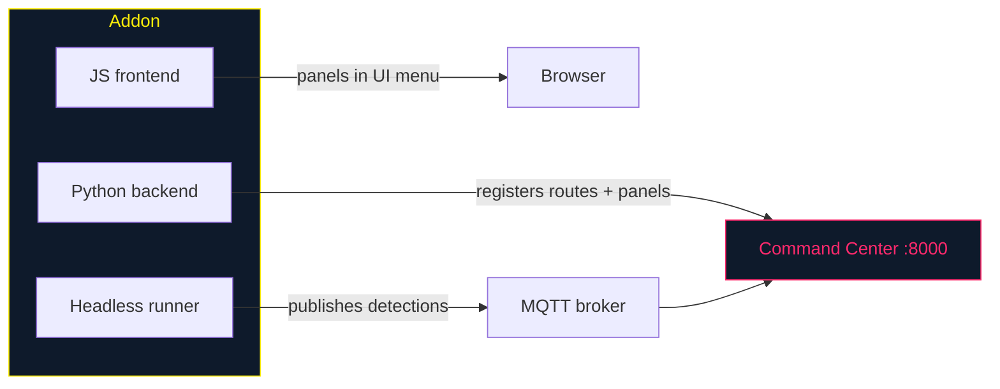

# tritium-addons — Sensor Integrations

Drop-in sensor addons for the [Tritium](https://github.com/Valpatel/tritium) system. Each addon works three ways:

> **New here?** Start with the parent repo's [`docs/QUICKSTART.md`](https://github.com/Valpatel/tritium/blob/main/docs/QUICKSTART.md). Public SDK for closed-source cognition: [`tritium-sc/docs/EMBODIMENTS.md`](https://github.com/Valpatel/tritium-sc/blob/main/docs/EMBODIMENTS.md). Glossary: [`docs/GLOSSARY.md`](https://github.com/Valpatel/tritium/blob/main/docs/GLOSSARY.md).



1. **SC plugin** — panels in the Command Center UI, targets on the tactical map
2. **Standalone app** — full-screen at `/addon/{id}/`, PWA support for tablets
3. **Headless runner** — standalone on a Raspberry Pi, publishes to MQTT

## Addon status

| Addon | Status | Hardware | What it does |
|-------|--------|----------|-------------|
| [hackrf/](hackrf/) | **Functional** | HackRF One | Spectrum analysis, FM radio, ADS-B aircraft, TPMS vehicles, ISM bands |
| [meshtastic/](meshtastic/) | **Functional** | Any Meshtastic radio | LoRa mesh — GPS tracking, messaging, device config |
| [isaac_sim/](isaac_sim/) | **Connector** (SIL, live) | RTX GPU render host | NVIDIA Isaac Sim digital twins — Scene3D→USD, MJPEG cameras, onboard-camera→`camera_feeds` bridge, robot-body TCP seam. Live: a Newton-physics stand scene (`go2_newton_stand.usd`) + a PhysX velocity-command walk (`spot_policy_walk.py`) (see [DEVELOPER-GUIDE.md](DEVELOPER-GUIDE.md)) |
| [webhooks/](webhooks/) | **Functional (when configured)** | — | Real `httpx` POST of notifications to any URL. Inert until `WEBHOOKS_URL`+`WEBHOOKS_ENABLED` set |
| [discord/](discord/) | Stub (loaded) | — | Discord bot bridge |
| [telegram/](telegram/) | Stub (loaded) | — | Telegram bot bridge |
| [irc/](irc/) | Stub (loaded) | — | IRC bridge |
| [matrix/](matrix/) | Stub (loaded) | — | Matrix chat bridge |
| [slack/](slack/) | Stub (loaded) | — | Slack integration |
| [sms_gateway/](sms_gateway/) | Stub (loaded) | — | SMS gateway (Twilio / GSM modem) |
| [satellite/](satellite/) | Stub (loaded) | — | Satellite uplink (Iridium / Starlink / Inmarsat) |
| [signal_bridge/](signal_bridge/) | Stub (**not loaded**) | — | Signal via signal-cli; orphaned — dispatcher looks for dir `signal` (renamed to avoid shadowing stdlib `signal`) |
| [email_bridge/](email_bridge/) | Stub (**not loaded**) | — | SMTP relay; orphaned — dispatcher looks for dir `email` (renamed to avoid shadowing stdlib `email`) |

> Previously listed `wifi_csi/` as an empty placeholder; deleted in W203 because it was a lying manifest. See `tritium-sc/docs/technical-brief-ruview-csi-analysis.md` for the planned RuView-based implementation.

The ten `communications` addons are a **second addon archetype** — bare
`*Plugin` classes (not `SensorAddon`) loaded by a `CommsDispatcher` to relay
Tritium notifications *out* to a channel. Nine are pure stubs (`send_message()`
logs "Would send" and returns `True`); **`webhooks` is the exception** with a
real send path. Two (`signal_bridge`, `email_bridge`) don't even load today, and
all ten `routes.py` routers are unmounted. The full mechanism, the honest
per-addon status, and the drifts are documented in
**[COMMS-BRIDGES.md](COMMS-BRIDGES.md)**.

## Verified addon index (public + private catalog)

[`addon-index.json`](addon-index.json) is a static catalog of **all known
addons across repos** — public ones here, plus advanced/premium ones in
private repos (e.g. `tritium-addon-priv`). Each entry carries `name`,
short `description`, `license`, `owner`, source `repo`, `status`, and a
`verified` flag.

> **Honest status:** nothing in the codebase reads `addon-index.json` today
> (verified by grep across the tree). The live Addon Manager panel
> (`addons-manager.js`) lists only *installed* addons by discovering their
> manifests via `/api/addons/` and `/api/addons/manifests` (filesystem
> discovery through the `AddonLoader`). Wiring this cross-repo catalog into
> that UI — so it can advertise-and-gray-out addons from repos that aren't
> installed (Blender-style) — is future work, not a live feature.

| Addon | Repo | License | Owner | Status |
|-------|------|---------|-------|--------|
| nav-pro | tritium-addon-priv (private) | Proprietary | Valpatel Software LLC | functional |
| hackrf | tritium-addons | AGPL-3.0 | Valpatel Software LLC | functional |
| meshtastic | tritium-addons | AGPL-3.0 | Valpatel Software LLC | functional |
| isaac-sim | tritium-addons | AGPL-3.0 | Valpatel Software LLC | in-progress |
| webhooks | tritium-addons | AGPL-3.0 | Valpatel Software LLC | functional (when configured) |
| (9 comms stubs) | tritium-addons | AGPL-3.0 | Valpatel Software LLC | stub |

The index is **extensible**: add a `repos[]` entry to advertise a
third-party addon source, then list its addons. A private addon may be
**promoted to public** by moving its directory into this repo, switching
its manifest `license` to `AGPL-3.0`, and updating its index entry's
`repo`/`license` — the addon code already targets only the open SDK, so
no code change is needed.

## Quick start

```bash
# Addons are auto-discovered by the Command Center.
# Clone the parent repo with submodules:
git clone --recurse-submodules git@github.com:Valpatel/tritium.git

# Test a specific addon:
cd tritium-addons
python3 -m pytest hackrf/tests/ -v
python3 -m pytest meshtastic/tests/ -v
```

## Creating a new addon

**Follow the [Addon Developer Guide](DEVELOPER-GUIDE.md)** — the
canonical, code-grounded walkthrough (manifest, entry-point class, the
loader lifecycle, getting targets on the map, headless runner mode,
publishing). The layout it expects:

```
my-addon/
├── my_addon/
│   ├── __init__.py          # MyAddon(SensorAddon) — entry point
│   ├── runner.py            # MyRunner(BaseRunner) — headless mode
│   ├── router.py            # FastAPI routes
│   └── mqtt_bridge.py       # MQTT discovery for remote runners
├── frontend/
│   └── my-addon.js          # UI panel
├── tests/
│   └── test_my_addon.py
└── tritium_addon.toml        # Manifest (metadata, routes, capabilities)
```

The addon SDK lives in `tritium-lib` (`tritium_lib.sdk`). Full walkthrough: [DEVELOPER-GUIDE.md](DEVELOPER-GUIDE.md). Manifest quick-reference and repo conventions: [CLAUDE.md](CLAUDE.md).

Building an **outbound comms bridge** (relay notifications to Discord/Slack/email/…) instead of a sensor? That's a separate, lighter archetype — see **[COMMS-BRIDGES.md](COMMS-BRIDGES.md)**.

## How it grows

Each sensor type or data source becomes its own addon. The addon doesn't need to know about other addons — it just publishes detections to MQTT and/or registers with the Command Center's event bus. The target tracker and fusion engine handle the rest.

This means ADS-B aircraft tracking, TPMS tire pressure monitoring, LoRa mesh mapping, and spectrum analysis all work the same way: detect → publish → track → fuse → display.

---

AGPL-3.0 | Copyright 2026 Valpatel Software LLC
