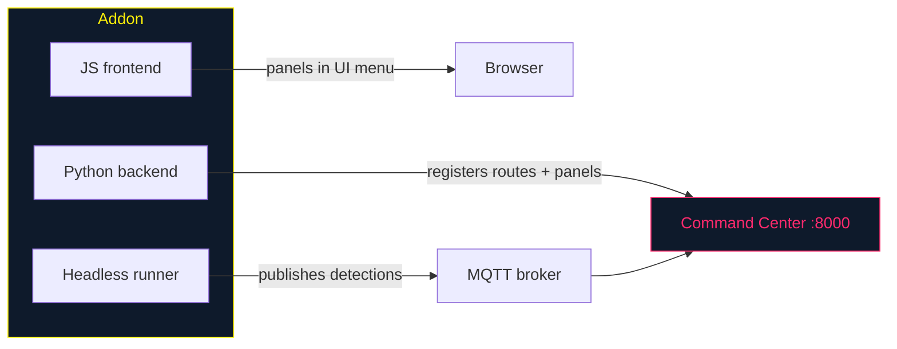

# tritium-addons — Sensor Integrations

Drop-in sensor addons for the [Tritium](https://github.com/Valpatel/tritium) system. Each addon works three ways:



1. **SC plugin** — panels in the Command Center UI, targets on the tactical map
2. **Standalone app** — full-screen at `/addon/{id}/`, PWA support for tablets
3. **Headless runner** — standalone on a Raspberry Pi, publishes to MQTT

## Addon status

| Addon | Status | Hardware | What it does |
|-------|--------|----------|-------------|
| [hackrf/](hackrf/) | **Functional** | HackRF One | Spectrum analysis, FM radio, ADS-B aircraft, TPMS vehicles, ISM bands |
| [meshtastic/](meshtastic/) | **Functional** | Any Meshtastic radio | LoRa mesh — GPS tracking, messaging, device config |
| discord/ | Stub | — | Discord bot (scaffolding only) |
| telegram/ | Stub | — | Telegram bot (scaffolding only) |
| irc/ | Stub | — | IRC bridge (scaffolding only) |
| matrix/ | Stub | — | Matrix chat (scaffolding only) |
| signal/ | Stub | — | Signal messenger (scaffolding only) |
| slack/ | Stub | — | Slack integration (scaffolding only) |
| email/ | Stub | — | Email notifications (scaffolding only) |
| sms_gateway/ | Stub | — | SMS gateway (scaffolding only) |
| satellite/ | Stub | — | Satellite tracking (scaffolding only) |
| webhooks/ | Stub | — | Generic webhooks (scaffolding only) |

> Previously listed `wifi_csi/` as an empty placeholder; deleted in W203 because it was a lying manifest. See `tritium-sc/docs/technical-brief-ruview-csi-analysis.md` for the planned RuView-based implementation.

The stubs share the same pattern: a plugin class that logs "started (stub)" and a `send_message()` that returns `True` without connecting to anything. They exist as scaffolding for future implementation.

## Quick start

```bash
# Addons are auto-discovered by the Command Center.
# Clone the parent repo with submodules:
git clone --recurse-submodules git@github.com:Valpatel/tritium.git

# Test a specific addon:
cd tritium-addons
python3 -m pytest hackrf/tests/ -v
python3 -m pytest meshtastic/tests/ -v
```

## Creating a new addon

```
my-addon/
├── my_addon/
│   ├── __init__.py          # MyAddon(SensorAddon) — entry point
│   ├── runner.py            # MyRunner(BaseRunner) — headless mode
│   ├── router.py            # FastAPI routes
│   └── mqtt_bridge.py       # MQTT discovery for remote runners
├── frontend/
│   └── my-addon.js          # UI panel
├── tests/
│   └── test_my_addon.py
└── tritium_addon.toml        # Manifest (metadata, routes, capabilities)
```

The addon SDK lives in `tritium-lib` (`tritium_lib.sdk`). See [CLAUDE.md](CLAUDE.md) for the full manifest format and conventions.

## How it grows

Each sensor type or data source becomes its own addon. The addon doesn't need to know about other addons — it just publishes detections to MQTT and/or registers with the Command Center's event bus. The target tracker and fusion engine handle the rest.

This means ADS-B aircraft tracking, TPMS tire pressure monitoring, LoRa mesh mapping, and spectrum analysis all work the same way: detect → publish → track → fuse → display.

---

AGPL-3.0 | Copyright 2026 Valpatel Software LLC
