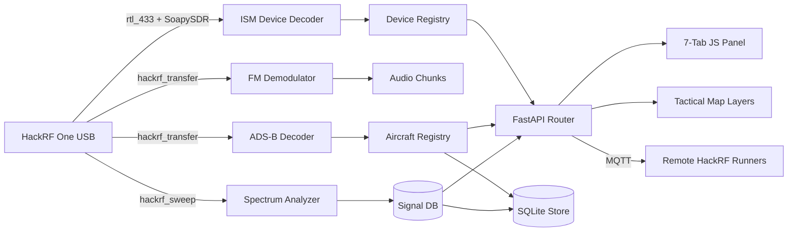

# HackRF One SDR Addon

Software Defined Radio addon for Tritium using the HackRF One (1 MHz - 6 GHz).

## How It Works



## Source Files

### `hackrf_addon/` — Python Backend
| File | Description |
|------|-------------|
| `__init__.py` | `HackRFAddon(SensorAddon)` — plugin entry point, multi-device support, background poll loop |
| `device.py` | **Control plane.** Device detection via `hackrf_info`, firmware flashing, clock/antenna/bias-tee control. `detect()` returns a rich `dict` the addon consumes directly |
| `sdr_device.py` | **Data plane.** `HackRFSDRDevice(SDRDevice)` — the real-hardware adapter for the `tritium_lib.sdr.SDRDevice` ABC (`detect→SDRInfo`, `sweep→SweepResult`, `tune`/`stop`/`read_iq`). Composes a `HackRFDevice` for identity; drives `hackrf_sweep`/`hackrf_transfer`. Previously only `SimulatedSDR` satisfied the ABC — now one real backend does too |
| `spectrum.py` | Spectrum analyzer wrapping `hackrf_sweep` subprocess, CSV parser |
| `receiver.py` | IQ capture via `hackrf_transfer` with configurable gain and sample rate |
| `fm_player.py` | Real-time FM demodulation (LPF, discriminator, de-emphasis) with WAV streaming |
| `signal_db.py` | In-memory ring buffer (100K measurements) with peak detection and sweep queries |
| `data_store.py` | Persistent SQLite store for signals, aircraft, TPMS, decoded devices, RF snapshots |
| `continuous_scan.py` | 24/7 band scanner cycling through 9 frequency bands (ISM, FM, ADS-B, WiFi, etc.) |
| `radio_lock.py` | Mutual exclusion — HackRF is single-radio, only one operation at a time |
| `mqtt_bridge.py` | Auto-discovers remote HackRF runners via MQTT, ingests their spectrum data |
| `router.py` | FastAPI routes and GeoJSON endpoints for all SDR features |
| `runner.py` | `HackRFRunner(BaseRunner)` — standalone headless mode for remote Raspberry Pi |
| `decoders/__init__.py` | Exports all signal decoders |
| `decoders/fm_radio.py` | FM broadcast demodulation with US station lookup table |
| `decoders/adsb.py` | ADS-B 1090 MHz decoder — preamble detection, CRC-24, CPR position, velocity |
| `decoders/tpms.py` | TPMS tire pressure decoder (315/433 MHz OOK envelope detection, sensor ID extraction) |
| `decoders/ism_monitor.py` | ISM band monitor (315, 433, 868, 915 MHz) with device fingerprinting |
| `decoders/rtl433_wrapper.py` | Wraps `rtl_433` subprocess for 200+ device protocol decoding |

### Two device abstractions — control plane vs data plane

The addon deliberately keeps **two** views of the radio rather than forcing one
class to serve both:

- **`HackRFDevice` (control plane)** owns identity, firmware flashing, clock
  (CLKIN/CLKOUT), Opera Cake antenna switching, bias-tee, and diagnostics. Its
  `detect()` returns a rich **dict** that the addon, router, and health check
  read directly. This is the plane the whole feature set is built on.
- **`HackRFSDRDevice` (data plane)** is a thin adapter that implements the
  generic `tritium_lib.sdr.SDRDevice` ABC (`detect→SDRInfo`, `sweep→SweepResult`,
  `tune`/`stop`/`read_iq`) against the real `hackrf_*` CLI tools, composing a
  `HackRFDevice` for identity. It exists so lib-side SDR consumers that program
  to the ABC (previously served only by `SimulatedSDR`) get a real hardware
  backend. Forcing the ABC onto `HackRFDevice` would have broken every dict
  consumer or lied about return types — so the two planes stay separate.

### Other Files
| File | Description |
|------|-------------|
| `frontend/hackrf.js` | 7-tab panel: Radio, Spectrum, Signals, Devices, Aircraft, Config, Firmware |
| `tests/` | 333 pytest tests across 13 test files (incl. `test_sdr_device.py` for the ABC adapter) |
| `tritium_addon.toml` | Addon manifest (USB VID:PID `1d50:6089`, router prefix `/api/addons/hackrf`) |
| `setup.sh` | Installs hackrf tools, rtl_433, numpy/scipy, udev rules |

## Quick Start

```bash
./setup.sh                                    # Install dependencies
python3 -m pytest hackrf/tests/ -v            # Run 333 tests
hackrf_info                                   # Verify hardware
hackrf_sweep -f 88:108 -w 500000 -1           # Quick FM band sweep
cd tritium-sc && ./start.sh                   # Panel in WINDOWS > RADIO menu
```

## Hardware

| Item | Required | Notes |
|------|----------|-------|
| HackRF One | Yes | ~$350, 1 MHz - 6 GHz, 20 MHz bandwidth |
| Antenna | Yes | Telescopic for general use, or band-specific |
| rtl_433 | Optional | Enables 200+ ISM device protocol decoding |
| SMA adapter | Optional | For external/directional antennas |

The addon runs in degraded mode without hardware (no live data, tests still pass).

## Feeding the Command Center tactical map (runbook)

The SC `sdr_monitor` plugin is the single writer for SDR-derived map targets and
owns `/api/sdr` (the endpoints the ADS-B overlay and Sensing tables poll). The
hardware SDR plugin's own endpoints live under `/api/sdr/hw`. Real receivers feed
the map over MQTT:

- **ADS-B**: run a `dump1090 --net` feeder and bridge its JSON frames (one
  object per aircraft, `hex`/`flight`/`lat`/`lon`/`altitude`/`speed`/`track`/
  `squawk`) to `tritium/{site}/sdr/{id}/adsb`. Each frame becomes an
  `adsb_{icao}` TrackedTarget with `source=adsb`.
- **ISM devices**: stock `rtl_433 -F mqtt://BROKER:1883` publishes
  `rtl_433/{hostname}/events` — `sdr_monitor` subscribes to both
  `rtl_433/events` and `rtl_433/+/events`.

No hardware? `POST /api/sdr/demo/start` (or demo mode) drives the same ingest
pipeline with synthetic aircraft and ISM devices, and
`POST /api/sdr/ingest/adsb` accepts dump1090-format frames over HTTP for testing.
