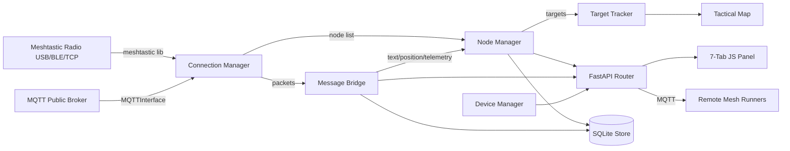

# Meshtastic LoRa Mesh Addon

LoRa mesh radio addon for Tritium — tracks 250+ mesh nodes with GPS, messaging, and device management.

## How It Works



## Source Files

### `meshtastic_addon/` — Python Backend
| File | Description |
|------|-------------|
| `__init__.py` | `MeshtasticAddon(SensorAddon)` — plugin entry point, multi-radio support, auto-connect |
| `connection.py` | Serial/TCP/BLE/MQTT connection manager with auto-detect, retries, DTR drain |
| `node_manager.py` | Converts mesh nodes to Tritium targets, BFS hop estimation, position anchors |
| `device_manager.py` | Device configuration (LoRa params, channels, user), firmware management |
| `message_bridge.py` | Bidirectional mesh-to-Tritium messaging (text, position, telemetry, nodeinfo) |
| `data_store.py` | Persistent SQLite store for nodes, positions, telemetry, messages, network stats |
| `mqtt_bridge.py` | Auto-discovers remote Meshtastic runners via MQTT, ingests their node data |
| `router.py` | FastAPI routes and GeoJSON endpoints for nodes, messages, config, multi-radio |
| `runner.py` | `MeshtasticRunner(BaseRunner)` — standalone headless mode for remote Raspberry Pi |
| `ble_direct.py` | Direct BLE connection via bleak, bypasses meshtastic library BLE race conditions |

### Other Files
| File | Description |
|------|-------------|
| `frontend/meshtastic.js` | 7-tab panel: Radio, Messages, Nodes, Channels, Config, Modules, Firmware |
| `frontend/mesh-network.js` | Network overview panel with connection status and stats |
| `frontend/mesh-nodes.js` | Node table with sorting, filtering, GPS/battery/SNR columns |
| `frontend/mesh-config.js` | Device configuration form (LoRa region, modem preset, tx power) |
| `frontend/mesh-messages.js` | Chat interface for mesh text messaging |
| `tests/` | 522 pytest tests across 9 test files |
| `tritium_addon.toml` | Addon manifest (VID:PIDs for ESP32/SiLabs/CH340, router prefix `/api/addons/meshtastic`) |
| `docs/MESHTASTIC-API-NOTES.md` | Hard-won notes on meshtastic Python library behavior |

## Quick Start

```bash
pip install meshtastic                        # Install dependency
python3 -m pytest meshtastic/tests/ -v        # Run 522 tests
meshtastic --info                             # Verify hardware
cd tritium-sc && ./start.sh                   # Panel in WINDOWS > RADIO menu
# Or connect manually:
curl -X POST localhost:8000/api/addons/meshtastic/connect -d '{"port":"/dev/ttyACM0"}'
```

## Hardware

| Item | Required | Notes |
|------|----------|-------|
| Meshtastic radio | Yes | T-LoRa Pager, T-Beam, Heltec, RAK, etc. ($25-80) |
| USB cable | For serial | Most radios use USB-C |
| BLE | Alternative | Connect wirelessly (bleak required: `pip install bleak`) |
| TCP/WiFi | Alternative | For radios with WiFi (set `MESHTASTIC_TCP_HOST` env var) |
| MQTT | Alternative | No local radio needed — connects to `mqtt.meshtastic.org` |

Four transport modes: USB serial (fastest), BLE (wireless), TCP/WiFi (network), MQTT (no radio).
The addon auto-detects serial ports by VID:PID and connects on startup.
